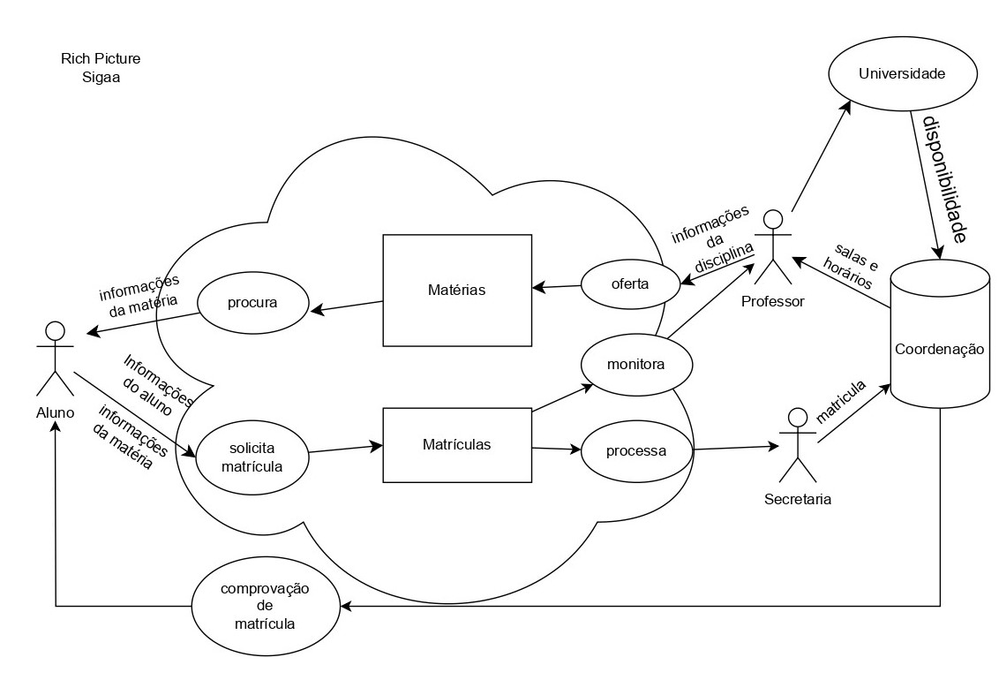

## Introdução

Cada membro da equipe realizou do seu app escolhido um Rich Picture

A tabela 1 descreve o integrante que fez a avaliação, e o app que avaliou.

**Tabela 1 -** Aplicativos avaliados

| Integrante                                     | Aplicativo Avaliado         |
| ---------------------------------------------- | --------------------- |
| [Eric Akio](https://github.com/eric-kingu)     | [Sigaa](#sigaa)
| [Gabriel Dantas](https://github.com/gbevi)     | [DetranDF](#detrandf) |
| [Giovana Silva](https://github.com/gio221)     | [Sou.gov](#sou.gov)   |
| [João Lobo](https://github.com/joaolobo10)     |   [Metrô-DF](#Metrô-DF)                    |
| [Luiz Bessa](https://github.com/lfelipebessa)  | [e-Título](#e-Título) |
| [Maria Eduarda](https://github.com/maaduh)     |  [CNH Digital](#CNH Digital)                     |
| [Pedro Tulio](https://github.com/PedrooCamilo) |  [BRB Mobilidade](#BRB Mobilidade)                     |

## Objetivo

O objetivo desse artefato é documentar cada Rcih Picture.

## Metodologia

A metodologia utilizada foi o Rich Picture

## Sigaa

O integrante responsável por avaliar o Sigaa foi o Eric Akio. O Rich Picture é o apresentado na Figura 1.

{width=70%}

**Figura 1:** Imagem Rich Picture do site sigaa. **Fonte:** Rich Picture  (Autoria: [Eric](https://github.com/eric-kingu)), 2025.

## DetranDF

O integrante responsável por avaliar o DetranDF foi o Gabriel Dantas. O Rich Picture é esse apresentado na Figura 2.

{ width=70% }

**Figura 2:** Imagem Rich Picture do app DetranDF. **Fonte:** Rich Picture  (Autoria: [Gabriel Dantas](https://github.com/gbevi)), 2025.

## Sou.gov

A integrante responsável por avaliar o Sou.gov foi a Giovana Barbosa. O Rich Picture é esse apresentado na Figura 3

{ width70% }

**Figura 3:** Imagem Rich Picture do app Sou.gov. **Fonte:** Rich Picture  (Autoria: [Giovana Barbosa ](https://github.com/gio221)), 2025.

 

## Metrô-DF

O integrante responsável por avaliar o Metrô-DF foi o João Carlos Lobo. O Rich Picture é esse apresentado na Figura 4

{ width=70% }

**Figura 4:** Imagem Rich Picture do app Metrô-DF. **Fonte:** Rich Picture  (Autoria: [João Lobo](https://github.com/joaolobo10)), 2025.

## e-Título

O integrante responsável por avaliar o e-Título foi o Luiz Felipe Bessa. O Rich Picture é esse apresentado na Figura 5

{ width=70% }

**Figura 5:** Imagem Rich Picture do app e-Título. **Fonte:** Rich Picture  (Autoria: [Luiz Bessa](https://github.com/lfelipebessa)), 2025.

## CNH Digital
A integrante responsável por avaliar o CNH Digital foi a Maria Eduarda Araujo Pereira. O Rich Picture é esse apresentado na Figura 6

{ width=70% }

**Figura 6:** Imagem Rich Picture do CNH Digital. **Fonte:** Rich Picture  (Autoria: [Maria Eduarda](https://github.com/maaduh)), 2025.

## BRB Mobilidade

O integrante responsável por avaliar o BRB Mobilidade foi o Pedro Túlio Curvelo Camilo. O Rich Picture é esse apresentado na Figura 7

{ width=70% }

**Figura 7:** Imagem Rich Picture do app BRB Mobilidade. **Fonte:** Rich Picture  (Autoria: [Pedro Camilo](https://github.com/PedrooCamilo)), 2025.

## Bibliografia

> 1. Aplicativo do Sou.gov. Disponível em: Apple Store. Acesso em: 07 abr 2024.
> 2. Aplicativo do e-Título. Disponível em: Apple Store. Acesso em: 08 abr 2024.
> 3. Aplicativo do DetranDF. Disponível em: Apple Store. Acesso em: 11 abr 2024.
> 4. Aplicativo do BRB Mobilidade. Disponível em: Apple Store. Acesso em: 12 abr 2025.
> 5. Aplicativo do Metrô-DF. Disponível em: Apple Store. Acesso em: 12 abr 2025.
> 6. Aplicativo do CNH Digital. Disponível em: Apple Store. Acesso em: 12 abr 2025.
> 7.  Sigaa. Disponível em: [Sigaa](https://autenticacao.unb.br/sso-server/login?service=https%3A%2F%2Fsig.unb.br%2Fsigaa%2Flogin%2Fcas), acesso em 12 de abr. de 2025.

## Histórico de versão

| Versão |    Data    |       Descrição        |                     Autor                     | Revisor |
| :----: | :--------: | :--------------------: | :-------------------------------------------: | :-----: |
|  1.0   | 10/04/2025 | Início da documentação | [Giovana Barbosa ](https://github.com/gio221) |  [João Lobo](https://github.com/joaolobo10)    |
|  1.1   | 11/04/2025 |      App sou.gov       | [Giovana Barbosa ](https://github.com/gio221) |  [João Lobo](https://github.com/joaolobo10) |
|  1.2   | 11/04/2025 |      App e-Título      | [Luiz Bessa](https://github.com/lfelipebessa) |     [Giovana Barbosa](https://github.com/gio221)     |
|  1.3   | 11/04/2025 |      App DetranDF      |  [Gabriel Dantas](https://github.com/gbevi)   |     [Giovana Barbosa](https://github.com/gio221)     |
|  1.4   | 12/04/2025 |      App BRB Mobilidade      |  [Pedro Camilo](https://github.com/PedrooCamilo)   |     [João Lobo](https://github.com/joaolobo10)     |
|  1.5   | 12/04/2025 |      App Metrô-DF      |  [João Lobo](https://github.com/joaolobo10)   |      [João Lobo](https://github.com/joaolobo10)    |
|  1.6   | 12/04/2025 |      App CNH Digital      |  [Maria Eduarda](https://github.com/maaduh)   |   [João Lobo](https://github.com/joaolobo10)       |
