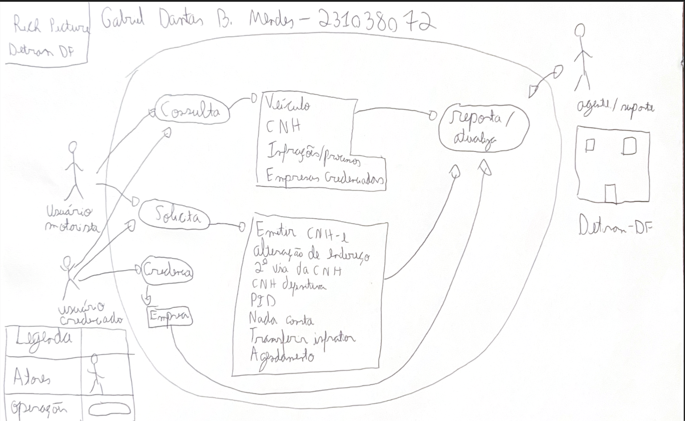

## Introdução

Cada membro da equipe realizou do seu app escolhido um Rich Picture

A tabela 1 descreve o integrante que fez a avaliação, e o app que avaliou.

    Tabela 1: sites avaliados

| Integrante                                         | Site Avaliado      | 
| --------------------------------------------------- | ------------------ | 
| [Eric](https://github.com/eric-kingu)              |         |
| [Gabriel Dantas](https://github.com/gbevi)         |  [DetranDF](#detrandf)       |
| [Giovana Silva](https://github.com/gio221)         | [Sou.gov](#sou.gov) |
| [João Lobo](https://github.com/joaolobo10)         |         |
| [Luiz Bessa](https://github.com/lfelipebessa)      |[e-Título](#e-Título)|
| [Maria Eduarda](https://github.com/maaduh)         |         |
| [Pedro Tulio](https://github.com/PedrooCamilo)     |         |

## Obejetivo
O obejtivo desse artefato é documentar cada Rcih Picture

## Metodologia
A metodologia utilizada foi o Rich Picture

## Sou.gov
A integrante responsável por avaliar o Sou.gov foi a Giovana Barbosa. O Rich Picture é esse apresentado na Figura 1

{ width=50% }

    
 Figura 1: Imagem Rich Picture do app sou.gov . Fonte: Rich Picture
    
 

 

## e-Título
O integrante responsável por avaliar o e-Título foi o Luiz Felipe Bessa. O Rich Picture é esse apresentado na Figura 2

{ width=70% }

    
 Figura 2: Imagem Rich Picture do app e-Título. Fonte: Rich Picture(Autoria Própria)
    
 

## DetranDF
O integrante responsável por avaliar o DetranDF foi o Gabriel Dantas. O Rich Picture é esse apresentado na Figura 3

{ width=70% }

    
 Figura 3: Imagem Rich Picture do app DetranDF. Fonte: Rich Picture(Autoria Própria)
    
 

## Bibliografia
> Aplicativo do Sou.gov. Disponível em: Apple Store. Acesso em: 07 abr 2024.
> Aplicativo do e-Título. Disponível em: Apple Store. Acesso em: 08 abr 2024.
> Aplicativo do DetranDF. Disponível em: Apple Store. Acesso em: 11 abr 2024.

## Histórico de versão
      Tabela que descreve o Histórico de Versões
| Versão |    Data    |       Descrição        |                   Autor                    | Revisor |
| :----: | :--------: | :--------------------: | :----------------------------------------: | :-----: |
|  1.0   | 10/04/2025 | Início da documentação |  [Giovana Barbosa ](https://github.com/gio221) |         |
|  1.0   | 11/04/2025 | App sou.gov |  [Giovana Barbosa ](https://github.com/gio221) |         |
|  1.0   | 11/04/2025 | App e-Título |  [Luiz Bessa](https://github.com/lfelipebessa) |         |
|  1.0   | 11/04/2025 | App DetranDF |  [Gabriel Dantas](https://github.com/gbevi) |         |