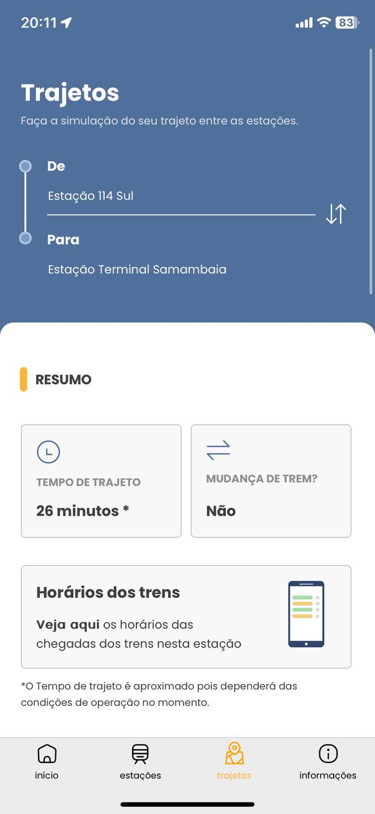

## Introdução

Cada membro da equipe se dedicou ao planejamento e avaliação de aplicativos candidatos para o projeto em questão. Todas as avaliações foram conduzidas com base nas atividades do Rich Picture. Na Tabela 1 abaixo, estão apresentados os apps selecionados por cada integrante:

A **tabela 1** descreve o integrante que fez a avaliação, e o app que avaliou.

    
Tabela 1: Heatmap.

| Integrante                                     | Site Avaliado         |
| ---------------------------------------------- | --------------------- |
| [Eric](https://github.com/eric-kingu)          |                       |
| [Gabriel Dantas](https://github.com/gbevi)     |  [DetranDF](#detrandf)                     |
| [Giovana Silva](https://github.com/gio221)     | [Sou.gov](#sou.gov)   |
| [João Lobo](https://github.com/joaolobo10)     | [Metrô-DF](#Metrô-DF) |
| [Luiz Bessa](https://github.com/lfelipebessa)  | [e-Título](#e-Título) |
| [Maria Eduarda](https://github.com/maaduh)     |                       |
| [Pedro Tulio](https://github.com/PedrooCamilo) |                       |

Fonte: [Giovana Barbosa ](https://github.com/gio221), 2025.

## Objetivo

O objetivo deste documento é relatar a avaliação dos apps feitos para a escolha do app para o projeto.

## Metodologia

A metodologia utilizada foi o Rich Picture

## Sou.gov

A integrante responsável por avaliar o Sou.gov foi a Giovana Barbosa. A avaliação tinha como objetivo fazer o rich picture, primeiro verifiquei se o app possuia 7 funcionalidades, para poder trabalharmos ele em grupo, e depois verifica se o grupo teria acesso aos usuários desse app, depois montei o rich picture

{ width=50% }

Figura 1: Imagem do app sou.gov. Fonte: App Sou.gov

## Metrô

O integrante responsável por avaliar o Metrô-DF foi o João Lobo. A avaliação tinha como objetivo fazer o rich picture, primeiro verifiquei se o aplicativo tinha 7 funcionalidades, para que fosse possível ser utilizado pelo grupo. Após isso verifiquei se era possível ter acesso a usuários do aplicativo. E por fim, desenvolvi o Rich picture do app Metrô-DF.

|   {width=300}   |   {width=300}   |
| :---------------------------------------------------------------: | :---------------------------------------------------------------: |
| **Figura 1**: Página inicial do app Metrô-DF. Fonte: App e-Título | **Figura 2**: Funcionalidade do app Metrô-DF. Fonte: App e-Título |

## e-Título

O integrante responsável por avaliar o e-Título foi o Luiz Felipe Bessa. A avaliação tinha como objetivo fazer o rich picture. Primeiro, foi verificado se o app possuía 7 funcionalidades, para que dessa forma fosse possível o grupo trabalhar em cima desse aplicativo, e depois foi verificado se o grupo teria acesso aos usuários desse app. Após isso, foi desenvolvido o rich picture.

|        {width=300}       |            {width=300}           |
| :-------------------------------------------------------------------------: | :---------------------------------------------------------------------------------: |
| **Figura 1**: Imagem da página inicial do app e-Título. Fonte: App e-Título | **Figura 2**: Imagem de outras funcionalidades do app e-Título. Fonte: App e-Título |

## DetranDF

Gabriel Dantas foi o responsável por avaliar o aplicativo DetranDF. O principal objetivo da avaliação era elaborar o rich picture. Inicialmente, verificou-se se o aplicativo possuía ao menos sete funcionalidades, o que permitiria ao grupo utilizá-lo como base para o trabalho. Em seguida, analisou-se se o grupo teria acesso aos usuários do app. Com esses critérios atendidos, o rich picture foi então desenvolvido.

|        {width=300}       |            {width=300}           |
| :-------------------------------------------------------------------------: | :---------------------------------------------------------------------------------: |
| **Figura 1**: Imagem da página inicial do app DetranDF. Fonte: App e-Título | **Figura 2**: Imagem de outras funcionalidades do app DetranDF. Fonte: App DetranDF |

## Bibliografia

> 1. Aplicativo do Sou.gov. Disponível em: Apple Store. Acesso em: 07 abr 2025.
> 2. Aplicativo do Metrô-DF. Disponível em: Apple Store. Acesso em: 10 abr 2025.
> 3. Aplicativo do e-Título. Disponível em: Apple Store. Acesso em: 11 abr 2025.
> 3. Aplicativo do DetranDF. Disponível em: Apple Store. Acesso em: 12 abr 2025.

## Histórico de versão

| Versão |    Data    |       Descrição        |                     Autor                      |                  Revisor                   |
| :----: | :--------: | :--------------------: | :--------------------------------------------: | :----------------------------------------: |
|  1.0   | 09/04/2025 | Início da documentação | [Giovana Barbosa ](https://github.com/gio221)  | [João Lobo](https://github.com/joaolobo10) |
|  1.1   | 10/04/2025 |      App sou.gov       | [Giovana Barbosa ](https://github.com/gio221)  | [João Lobo](https://github.com/joaolobo10) |
|  1.2   | 10/04/2025 |      App e-Título      | [Luiz Bessa ](https://github.com/lfelipebessa) | [João Lobo](https://github.com/joaolobo10) |
|  1.3   | 11/04/2025 |      App Metrô-DF      |   [João Lobo](https://github.com/joaolobo10)   |                                            |
|  1.4   | 12/04/2025 |      App DetranDF      |   [Gabriel Dantas](https://github.com/gbevi)   |                                            |
